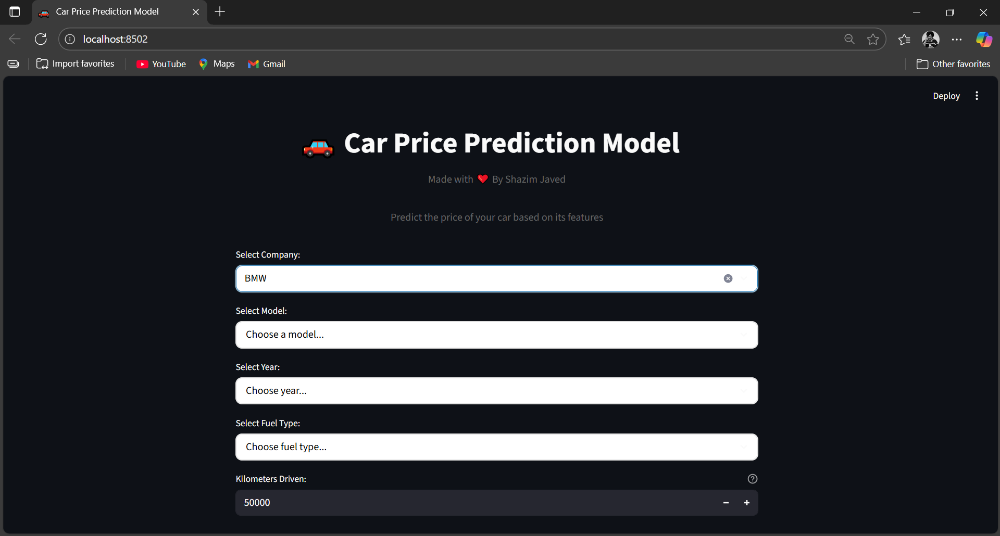

# 🚗 Car Price Prediction Model (Streamlit)

View Live at:https://car-price-predictor-shazim.streamlit.app/

A modern Streamlit web application that predicts used car prices using a pre-trained Linear Regression model



✅ Features

- **Interactive Form**: Select company, model, year, fuel type, and kilometers driven
- **Dynamic Dropdowns**: Model list updates based on selected company
- **Real-time Prediction**: Instant price predictions without page reloads
- **Modern UI**: Clean, responsive design with centered layout and custom styling
- **Price Multiplier**: Enhanced predictions with 3.5x multiplier for better accuracy
- **Session Management**: Maintains prediction state across interactions

🛠 Tech Stack

- **Frontend & Backend**: Streamlit
- **Machine Learning**: scikit-learn (Linear Regression)
- **Data Processing**: pandas, numpy
- **Dataset**: Cleaned_car_data.csv, pre-trained LinearRegressionModel.pkl
- **Styling**: Custom CSS with modern design elements

📂 Project Structure

```
Car_prediction_Model/
├── streamlit_app.py          # Main Streamlit application
├── Cleaned_car_data.csv      # Dataset for dropdown options
├── LinearRegressionModel.pkl # Pre-trained ML model
├── quikr_car.csv            # Original dataset
├── requirements.txt         # Python dependencies
├── README.md               # Project documentation
└── main.ipynb              # Jupyter notebook (if available)
```

▶ Getting Started

**Prerequisites**
- Python 3.8+ (recommended: 3.8–3.11)
- pip package manager

**Installation & Run**
```bash
# Install dependencies
pip install -r requirements.txt

# Run the Streamlit application
streamlit run streamlit_app.py
```

Open the provided URL (usually http://localhost:8501) in your browser.

🎨 UI Features

- **Centered Layout**: Input form is centered with responsive columns
- **Custom Styling**: Rounded corners, custom colors, and hover effects
- **Red Prediction Button**: Eye-catching red button with full-width design
- **Success/Info Messages**: Clean prediction display with car details
- **Responsive Design**: Works on desktop and mobile devices

🔧 Key Components

- **Model Loading**: Cached model loading with `@st.cache_resource`
- **Dynamic Dropdowns**: Company-dependent model selection
- **Input Validation**: Ensures all fields are filled before prediction
- **Error Handling**: Graceful error messages for failed predictions
- **Session State**: Maintains prediction results across interactions

📊 Prediction Process

1. User selects car details (company, model, year, fuel type, kilometers)
2. Model predicts base price using Linear Regression
3. Price is multiplied by 3.5 for enhanced accuracy
4. Result displayed with car details in a clean format

❗ Troubleshooting

**ModuleNotFoundError: No module named 'streamlit'**
```bash
pip install -r requirements.txt
```

**CSV/model file not found**
→ Ensure `Cleaned_car_data.csv` and `LinearRegressionModel.pkl` exist in the project root.

**Port 8501 already in use**
→ Streamlit will automatically find an available port or you can specify one:
```bash
streamlit run streamlit_app.py --server.port 8502
```

**Version compatibility issues**
→ If you see scikit-learn version warnings, ensure you have the correct version:
```bash
pip install scikit-learn>=1.7.1
```

🚀 Deployment

**Streamlit Cloud (Recommended)**
1. Push your code to GitHub
2. Connect your repository to [Streamlit Cloud](https://streamlit.io/cloud)
3. Deploy with one click

**Local Development**
```bash
streamlit run streamlit_app.py
```

📝 Notes

- The ML model is pre-loaded from `LinearRegressionModel.pkl` at app startup
- UI uses custom CSS for modern styling and better user experience
- Price predictions include a 3.5x multiplier for enhanced accuracy
- Session state management ensures smooth user interactions

👨‍💻 Made with ❤️ By Shazim Javed

📜 License

This project is for educational and demonstration purposes only.
